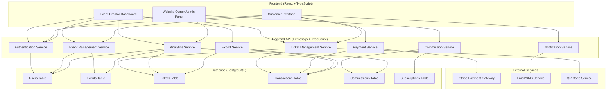
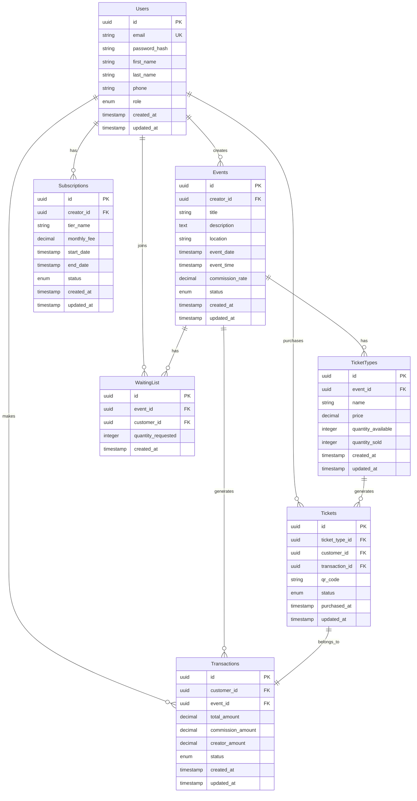

# Event Management System Architecture

## System Overview

The Event Management System is a full-stack TypeScript application connecting three key user groups:
- Event Creators
- Customers
- Website Owners

## Technology Stack

- **Frontend**: React with Vite + TypeScript
- **Backend**: Express.js + TypeScript
- **Database**: PostgreSQL
- **Authentication**: JWT (JSON Web Tokens)
- **Payment Gateway**: Stripe
- **Additional**: QR code generation, Excel export, Email/SMS notifications

## System Architecture Diagram

## Database Schema Design

## API Endpoints Structure

### Authentication Endpoints
- `POST /api/auth/register` - User registration
- `POST /api/auth/login` - User login
- `POST /api/auth/logout` - User logout
- `POST /api/auth/refresh` - Refresh JWT token
- `GET /api/auth/profile` - Get user profile

### Event Management Endpoints
- `GET /api/events` - List all events (with filters)
- `GET /api/events/:id` - Get event details
- `POST /api/events` - Create new event (Event Creator)
- `PUT /api/events/:id` - Update event (Event Creator)
- `DELETE /api/events/:id` - Delete event (Event Creator)

### Ticket Management Endpoints
- `GET /api/events/:id/tickets` - Get available ticket types
- `POST /api/tickets/purchase` - Purchase tickets
- `GET /api/tickets/my-tickets` - Get user's tickets
- `POST /api/tickets/:id/transfer` - Transfer ticket
- `POST /api/tickets/:id/refund` - Request refund
- `POST /api/events/:id/waiting-list` - Join waiting list

### Payment Endpoints
- `POST /api/payments/create-intent` - Create payment intent
- `POST /api/payments/confirm` - Confirm payment
- `GET /api/payments/:id` - Get payment details

### Commission & Subscription Endpoints
- `GET /api/commissions` - Get commission settings (Website Owner)
- `PUT /api/commissions` - Update commission settings (Website Owner)
- `GET /api/subscriptions` - Get subscription tiers
- `POST /api/subscriptions/subscribe` - Subscribe to tier
- `GET /api/subscriptions/my-subscription` - Get user's subscription

### Analytics Endpoints
- `GET /api/analytics/dashboard` - Get dashboard data
- `GET /api/analytics/events/:id` - Get event analytics
- `GET /api/analytics/sales` - Get sales analytics
- `GET /api/analytics/commissions` - Get commission analytics

### Export Endpoints
- `GET /api/export/events/:id/attendees` - Export attendee list
- `GET /api/export/events/:id/sales` - Export sales data
- `GET /api/export/analytics` - Export analytics data

## Frontend Component Structure

### Shared Components
- `Header` - Navigation and user menu
- `Footer` - Site footer
- `LoadingSpinner` - Loading indicator
- `ErrorBoundary` - Error handling
- `ProtectedRoute` - Route protection wrapper

### Authentication Components
- `LoginForm` - User login form
- `RegisterForm` - User registration form
- `ForgotPasswordForm` - Password recovery

### Event Creator Components
- `EventDashboard` - Main dashboard
- `EventForm` - Create/edit event form
- `TicketTypeForm` - Configure ticket types
- `EventAnalytics` - Event analytics view
- `AttendeeList` - View and export attendees

### Customer Components
- `EventList` - Browse events
- `EventDetails` - Event information
- `TicketPurchase` - Purchase tickets
- `MyTickets` - View purchased tickets
- `TicketTransfer` - Transfer tickets
- `RefundRequest` - Request refunds

### Website Owner Components
- `AdminDashboard` - Main admin dashboard
- `CommissionSettings` - Configure commissions
- `SubscriptionManagement` - Manage subscription tiers
- `UserManagement` - Manage users
- `PlatformAnalytics` - Platform-wide analytics

## Security Considerations

1. **Authentication & Authorization**
   - JWT tokens with expiration
   - Role-based access control
   - Secure password hashing (bcrypt)

2. **Data Validation**
   - Input validation on all endpoints
   - SQL injection prevention
   - XSS protection

3. **Payment Security**
   - Secure Stripe integration
   - PCI compliance considerations
   - Transaction integrity checks

4. **API Security**
   - Rate limiting
   - CORS configuration
   - HTTPS enforcement

## Development Workflow

1. **Setup Phase**
   - Initialize project structure
   - Configure TypeScript
   - Set up development database

2. **Backend Development**
   - Implement authentication
   - Create API endpoints
   - Set up database models

3. **Frontend Development**
   - Build UI components
   - Implement state management
   - Connect to backend APIs

4. **Integration & Testing**
   - End-to-end testing
   - Payment integration testing
   - Performance optimization

5. **Documentation & Deployment**
   - API documentation
   - User guides
   - Deployment preparation